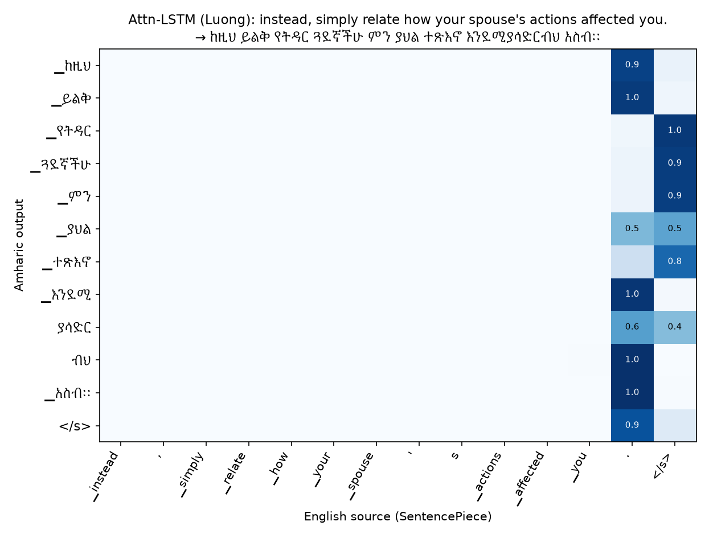

# English → Amharic Neural Machine Translation with LSTM Encoder–Decoders

**Technical report** · Deep Learning group project

_Group members: Etsubdink Zebre (GSE/0523/18), Franci Ayele (GSE/1254/18) and Henock Bonsa (GSE/3554/18)_

---

## Abstract

We build, compare and deploy LSTM-based neural machine translation (NMT) systems for
English → Amharic. After cleaning a public 237k-pair corpus down to 178k unique pairs
(and finding that its official validation split leaks into train/test), we train a
**basic Seq2Seq-LSTM** and an **attention-based Seq2Seq-LSTM** with identical encoders,
decoders, data and budgets, so that the comparison isolates the effect of attention.
The final **Attention-LSTM uses Bahdanau (additive) attention**. It nearly doubles
BLEU (5.96 → **11.20**), raises chrF from 16.6 to **24.4**, lowers test perplexity from
42.8 to **24.2**, and is better at every sentence length. It costs 15 % more parameters,
about 1.9× the training time per epoch, and about 2× the inference time.
A first attention model using Luong-style multiplicative attention improved only
modestly (BLEU 7.38). We show that its attention **collapsed onto the sentence-final
tokens**, so it acted as a second summary vector rather than an alignment. We keep it
as an ablation. The Bahdanau model learns interpretable alignments that capture
English SVO → Amharic SOV reordering. It is deployed behind a FastAPI `POST /translate`
endpoint with a web UI that shows the live attention map.

---

## 1. Dataset & preprocessing

### 1.1 Source and license

| | |
|---|---|
| Dataset | [`habtew/english-amharic-translation`](https://huggingface.co/datasets/habtew/english-amharic-translation) (Hugging Face Hub) |
| Format | Parquet, one `translation: {en, am}` struct per row; published splits train / validation / test |
| Size (raw) | 237,243 pairs (172,540 / 21,568 / 43,135) |
| License | **None declared** on the dataset card. The text is largely from publicly available Bible translations and Jehovah's Witnesses publications (NWT), plus news and some legal text. We therefore use it for non-commercial academic research only and do not redistribute it. |
| Download | `src/prepare_data.py` fetches the three parquet files over HTTPS |

### 1.2 Characteristics

* **Domain:** dominated by religious text (Bible verses, study articles). There is a
  smaller share of news, legal and conversational sentences. Vocabulary such as
  *Jehovah*, *God* and *disciples* is very frequent, while everyday vocabulary
  (*university*, *garden*) is rare. This skew matters for the demo.
* **Casing:** inconsistent. About half the English sentences are fully lower-cased.
* **Length:** 18.8 English words / 13.1 Amharic words per sentence on average, up to 269 words.
  Amharic has fewer, longer words because it is morphologically rich: subject, object,
  tense, negation and prepositions attach to the verb or noun as affixes.
* **Script:** Amharic uses the Ge'ez (Ethiopic) abugida. Each character is a
  consonant+vowel syllable. There are several homophone letter families
  (ሀ/ሐ/ኀ, ሰ/ሠ, አ/ዐ, ጸ/ፀ) that writers use interchangeably, and there is Ethiopic
  punctuation (። full stop, ፣ comma, ፤ semicolon, ፡ word separator).

### 1.3 Data-quality findings

| Issue | Count |
|---|---:|
| Exact duplicate pairs in the raw data | 21,568 |
| …of which are *across* published splits | **21,568**. The entire published validation split is a copy of rows from train/test |
| Empty sentences | 7 |
| Pairs that are almost entirely digits (bare scripture citations like `luke 18: 9 14.`) | 6,290 |
| Further duplicates after normalization | 41,319 |
| Same English source with a different Amharic translation | 11,407 |

Because of the leakage, **we pool all three published splits, clean and deduplicate them,
and re-split** ourselves.

### 1.4 Cleaning and normalization (`src/text.py`)

The same functions run at training time and inside the deployed API, so train and
serve preprocessing cannot drift apart.

* **Both languages:** Unicode NFC, unify curly/guillemet quotes to ASCII, strip zero-width and
  private-use characters, remove bracketed verse references `(13 36)`, collapse whitespace.
* **English:** lower-case, because casing in the corpus is arbitrary.
* **Amharic:**
  * map every homophone family to one canonical letter across all 7 vowel orders
    (e.g. ሐ→ሀ, ሠ→ሰ, ዐ→አ, ፀ→ጸ, ዓ→ኣ);
  * map labialised variants (ቈ→ቆ, ኰ→ኮ, ጐ→ጎ);
  * normalise Ethiopic punctuation (፡ → space, `::` → ።, ፥ → ፣, no space before punctuation).
* **Filtering:** drop missing or empty rows, wrong-script rows (<50 % Latin or <50 % Ethiopic
  characters), exact duplicates, and duplicate English sources (so that no source sentence
  can be in both train and test).

### 1.5 Tokenization and vocabulary

We use **SentencePiece unigram** subword models: one per language, 8,000 pieces each,
`character_coverage = 1.0` so that every Ge'ez syllable is covered. They are trained on the
training split only. Special ids: `<pad>=0, <unk>=1, <s>=2, </s>=3`. Subwords suit
Amharic's rich morphology. For example, እንደሚያሳድርብህ ("that it affects you"), which never
occurs in the training data, is segmented as `እንደሚ + ያሳድር + ብህ` (conjunction/aspect prefix + verb
stem + "on you"), and አልቻለችም ("she could not") as `አል + ቻ + ለች + ም` (negation + stem +
3rd person feminine + negation suffix). The `<unk>` rate on the test set is 0.0 % for English and
0.0005 % for Amharic.

### 1.6 Split and length filtering

The 178,220 clean pairs are shuffled (seed 42) and split 90 / 5 / 5. Training pairs longer than 50
subwords on either side, or with a length ratio above 3, are removed (11,251 pairs).
Validation and test keep sentences up to 100 subwords so that long-sentence behaviour can
be measured.

| Split | Pairs | EN words (mean / max) | AM words (mean / max) | EN subwords (mean) | AM subwords (mean) |
|---|---:|---:|---:|---:|---:|
| Train | 149,147 | 16.3 / 48 | 11.5 / 41 | 20.4 | 20.0 |
| Validation | 8,809 | 18.1 / 76 | 12.7 / 56 | 22.8 | 22.5 |
| Test | 8,815 | 18.1 / 86 | 12.7 / 56 | 22.7 | 22.3 |

The training set contains 82,534 English and 201,741 Amharic word types. That is 2.4× more
Amharic types, a direct measure of its morphological richness.

---

## 2. Models & training

### 2.1 Architectures (`src/models.py`)

All models share the same **encoder**, a 2-layer **bidirectional** LSTM (256 units per
direction, concatenated to 512), and the same **decoder**, a 2-layer unidirectional LSTM
with 512 units. The decoder is initialised from the encoder's final hidden and cell states,
with the two directions concatenated per layer. They differ only in how the decoder can
see the source:

| Model | How the decoder sees the source |
|---|---|
| **Seq2Seq-LSTM** (baseline; Sutskever et al. 2014) | Only through the encoder's final states: one fixed-size vector for the whole sentence. |
| **Attn-LSTM (Luong)** (Luong et al. 2015, *general* score, input feeding) | After each decoder step, the decoder output $h_t$ scores every encoder state, $h_t^\top W_a \bar h_s$. The softmax-weighted context $c_t$ gives $\tilde h_t=\tanh(W_c[c_t;h_t])$, which predicts the word and is also fed into the next step. |
| **Attention-LSTM (Bahdanau)** (Bahdanau et al. 2015, additive score). **The final attention model.** | *Before* producing word $t$, the previous decoder state $s_{t-1}$ scores every encoder state, $v^\top\tanh(W_q s_{t-1}+W_k \bar h_j)$. The context $c_t$ is concatenated with the previous word's embedding as the decoder LSTM input. The output layer sees $\tanh(W_o[s_t;c_t;y_{t-1}])$. |

The Luong model was our first attention model. §4.3 explains why it underperformed and why we
added the Bahdanau variant. All three are reported, so the Luong result also serves as an ablation on the
attention mechanism.

Padding positions are masked out of the attention softmax. Output layer: linear → softmax over
the 8,000 Amharic pieces.

### 2.2 Training configuration (identical for all models)

| Setting | Value |
|---|---|
| Embedding size | 256 (source and target) |
| Hidden units | 512 (encoder: 2 × 256 bidirectional; decoder: 512) |
| Layers | 2 encoder + 2 decoder |
| Dropout | 0.3 (embeddings, between LSTM layers, before output) |
| Batch size | 128 sentence pairs, length-bucketed |
| Optimizer | Adam, learning rate 1e-3, ReduceLROnPlateau (×0.5, patience 1) |
| Epochs | max 15, early stopping on validation loss (patience 3), best checkpoint kept |
| Loss | token-level cross-entropy, padding ignored |
| Teacher forcing | 100 % during training |
| Gradient clipping | global norm 1.0 |
| Decoding | greedy for corpus metrics; beam search (k = 5, GNMT length penalty α = 0.7) in the app |
| Hardware | Apple M1 Pro GPU (PyTorch MPS backend) |

### 2.3 Training behaviour

All three models were still improving slowly at epoch 15. Early stopping never triggered,
so the last epoch is the best checkpoint for each. A larger budget would help all of
them, but the fixed budget keeps the comparison fair. The Bahdanau model is ahead from
the first epoch: after 2 epochs its validation perplexity is 77, versus 133–134 for the
other two. Its train and validation losses stay close, so there is no sign of overfitting.

Training times: Seq2Seq and Luong were trained **concurrently** on the same GPU, so their
wall-clock times (106 and 165 min) are inflated. For a fair comparison we re-timed 150
training batches of each model **in isolation** (`src/benchmark.py`):

| | Seq2Seq-LSTM | Attn-LSTM (Luong) | Attn-LSTM (Bahdanau) |
|---|---:|---:|---:|
| Time per epoch, isolated | 3.3 min | 7.3 min | 6.2 min |
| Estimated training time (15 epochs), isolated | 50 min | 109 min | 92 min |

The baseline's decoder runs over the whole target sequence in a single cuDNN-style LSTM call.
Both attention models must loop step by step in Python, because each step's input depends
on the previous step's attention output. That is why attention costs about 2× the training time.

Saved models: `models/seq2seq.pt`, `models/attention.pt` (Luong) and `models/bahdanau.pt`.
Each is a checkpoint with its config and weights, and is loaded by `src/translator.py`
together with `models/spm_en.model` and `models/spm_am.model`.

---

## 3. Evaluation & comparison

All metrics are on the **8,815-sentence held-out test set**, which no model or tokenizer saw
during training. BLEU and chrF are computed with sacreBLEU on detokenized, normalized Amharic. We report
BLEU with the `intl` tokenizer as the primary number, because the default `13a` tokenizer does not
split Ethiopic punctuation (`ነው።` would be one token), and give `13a` BLEU for reference.

### 3.1 Comparison table

| Metric | Seq2Seq-LSTM | Attn-LSTM (Luong) | **Attention-LSTM (Bahdanau)** |
|---|---:|---:|---:|
| **BLEU** (greedy, full test set) | 5.96 | 7.38 | **11.20** |
| BLEU, `13a` tokenizer | 4.76 | 5.96 | **9.31** |
| **chrF** (greedy, full test set) | 16.59 | 19.09 | **24.44** |
| chrF++ | 15.55 | 18.07 | **23.33** |
| BLEU, beam 5 (first 1,000 test sentences) | 6.18 | 7.72 | **12.08** |
| chrF, beam 5 (first 1,000) | 16.87 | 19.16 | **25.42** |
| **Test loss** (cross-entropy / token) | 3.756 | 3.580 | **3.187** |
| Test perplexity | 42.8 | 35.9 | **24.2** |
| **Training time** (isolated estimate, 15 epochs) | **50 min** | 109 min | 92 min |
| **Inference time**, whole test set, batched greedy | **5.7 s** | 11.1 s | 10.5 s |
| …per sentence (batched) | **0.65 ms** | 1.26 ms | 1.19 ms |
| Latency, one sentence, beam 5 (median; what the API does) | **87 ms** | 188 ms | 183 ms |
| **Parameters** | **14.51 M** | 16.34 M | 16.74 M |

**Verdict: the Attention-LSTM (Bahdanau) is clearly the better translator.** It gains
+5.2 BLEU (+88 % relative) and +7.9 chrF over the baseline, and lowers perplexity by 43 %.
The price is 15 % more parameters and about 2× the training and inference time. At under 0.2 s
per sentence with beam search, that cost is irrelevant for an interactive application.
On the same 1,000 sentences, beam search adds +0.5 (Seq2Seq), +0.3 (Luong) and +0.7 (Bahdanau)
BLEU over greedy decoding.

The absolute scores are low, as expected for small recurrent models trained from scratch
for 15 epochs on ~150k pairs of a morphologically rich, low-resource language, with a single
reference translation. chrF is the more informative metric here. A single Amharic word
carries subject, object, tense and negation, so a nearly-correct word (right stem, wrong
suffix) scores zero in BLEU but earns partial credit in chrF.

### 3.2 Quality by sentence length

| Source length (subwords) | Sentences | Seq2Seq BLEU / chrF | Luong BLEU / chrF | **Bahdanau BLEU / chrF** |
|---|---:|---:|---:|---:|
| 1–10 | 1,706 | 11.4 / 22.2 | 13.4 / 24.9 | **18.5 / 31.0** |
| 11–20 | 2,884 | 8.2 / 18.2 | 9.8 / 20.9 | **13.7 / 26.2** |
| 21–30 | 2,137 | 6.3 / 16.6 | 7.7 / 19.0 | **11.3 / 24.0** |
| 31–40 | 1,119 | 4.9 / 15.7 | 6.3 / 18.4 | **10.5 / 23.9** |
| 41–60 | 787 | 3.2 / 14.4 | 4.4 / 16.7 | **8.2 / 22.6** |
| 61+ | 182 | 2.0 / 13.4 | 2.9 / 15.4 | **5.2 / 19.5** |

Quality drops with length for every model, but the gap *widens*. On sentences of 41–60
subwords, Bahdanau's BLEU is 2.6× the baseline's, against 1.6× on 1–10. Its chrF on 31–40
subwords (23.9) is still higher than the baseline's on the shortest sentences (22.2). This is
the classic "fixed-length bottleneck" result: one 512-d vector cannot hold a 40-word sentence,
but a decoder that can look back at every source position can. Sentences over 50 subwords were
never seen in training, and all models degrade most there.

### 3.3 Translation examples

Source → Reference → Seq2Seq output → Attention-LSTM output (test set, greedy decoding; more
in [results/examples.md](results/examples.md), with the Luong outputs too):

| # | Source | Reference | Seq2Seq-LSTM | Attention-LSTM (Bahdanau) |
|---|---|---|---|---|
| 1 | let us see how this is so. | እንዲህ የምንለው ለምን እንደሆነ እስቲ እንመልከት። | እስቲ ይህን ማድረግ የምንችለው እንዴት እንደሆነ **እስቲ** እንመልከት። | ይህ እንዴት እንደሆነ እስቲ እንመልከት። ✔ |
| 2 | soon this kingdom will cause god's will to be done everywhere on earth. | ይህ መንግስት በቅርቡ የአምላክ ፈቃድ በመላው ምድር ላይ እንዲፈጸም ያደርጋል። | ይህ መንግስት በምድር ላይ የአምላክ መንግስት **በምድር ላይ** እንዲኖሩ ያደርጋል። | ብዙም ሳይቆይ ይህ መንግስት የአምላክን ፈቃድ በምድር ላይ እንዲ**ፈርስ** ያደርጋል። |
| 3 | and moses and eleazar the priest spake with them in the plains of moab by jordan near jericho, saying, | ሙሴና ካህኑ አልኣዛር በዮርዳኖስ አጠገብ በኢያሪኮ ፊት ለፊት በሞኣብ ሜዳ ላይ። | ሙሴና ካህኑ በዮርዳኖስ ማዶ **በዮርዳኖስ አጠገብ በዮርዳኖስ አጠገብ** ባለው በዮርዳኖስ አጠገብ እንዲህ ብሎ ተናገረ: | ሙሴምና ካህኑ **አልኣዛር** እንዲህ ብሎ በኢያሪኮ በኢያሪኮ አጠገብ **በሞኣብ ሜዳ ላይ** እንዲህ ብለው ተናገሩ። |
| 4 | "i am making you a fortified copper wall to this people. | "ለዚህ ህዝብ ጠንካራ የመዳብ ቅጥር አደርግሃለሁ። | "የተከረከረ ገመድ፣ *(stops early)* | "ይህ ህዝብ የምፈርዱበት **የመዳብ ቅጥር አደርግሃለሁ።** |
| 5 | all the israelites from 20 years old and up … the total number registered was 603, 550. | … እድሜያቸው 20 አመትና ከዚያ በላይ … ጠቅላላ ቁጥር 603,550 ነበር። | እስራኤላውያን በሙሉ ከተመዘገቡት **20,400** ነበሩ፤ … | በእስራኤል ውስጥ **እድሜያቸው 20 ኣመትና ከዚያ በላይ የሆኑት** እስራኤላውያን በሙሉ … በአጠቃላይ **2,3,300** ነበሩ። |
| 6 | spanish is the official language of honduras. | የሆንዱራስ የስራ ቋንቋ ስፓንኛ ነው። | **የእንግሊዝኛ** ቋንቋ የእንግሊዝኛ ቋንቋ ነው። | **የእንግሊዝኛ** ቋንቋ የቋንቋው ቋንቋ ነው። |

Out-of-corpus sentences through the deployed app (beam 5):

| Input | Seq2Seq-LSTM | Attention-LSTM (Bahdanau) |
|---|---|---|
| I am going to the university. | እኔም ሆንኩ። ✘ ("I too became") | **ወደ ዩኒቨርሲቲዬ እሄዳለሁ።** ✔ ("I go to my university") |
| Thank you very much. | በጣም ተደሰትክ። ✘ ("you were very happy") | **በጣም አመሰግንሃለሁ።** ✔ |
| Where is the hospital? | ገበሬው ወዴት ነው? ✘ ("where is the farmer?") | **ሆስፒታልስ የት አለ?** ✔ |
| My father is a teacher. | አባቴ አባት ነው። ✘ ("my father is a father") | **አባቴ አስተማሪ ነው።** ✔ |
| We must help the poor. | ለድሃው አሳቢነት ማሳየት አለብን። ≈ | **ድሆችን መርዳት ይኖርብናል።** ✔ |
| I want to learn Amharic. | እኔም ሆንኩ። ✘ | እ**ንግሊዝኛ**ን ለመማር እፈልጋለሁ። ✘ ("…learn English") |
| Addis Ababa is the capital of Ethiopia. | ኢትዮጵያ ፌዴራል ፖሊስ ኮሚሽን ✘ | አዲስ አበባ ዋና ኢትዮጵያ ነው ≈ (missing "city") |

---

## 4. Error & attention analysis

### 4.1 Error categories

Each category is measured by a transparent heuristic in `src/analysis.py`. These are
indicators, not perfect detectors. We then read the outputs manually to explain them.
Full examples: [results/error_examples.md](results/error_examples.md).

| Error type (how measured) | Seq2Seq | Luong | **Bahdanau** |
|---|---:|---:|---:|
| **Repeated words**: % of outputs with a repeated word / bigram the reference lacks | 31.2 % | 34.2 % | **22.2 %** |
| **Missing words**: % of outputs shorter than 0.7 × reference | 18.3 % | 16.2 % | **14.1 %** |
| **Additional words**: % of outputs longer than 1.4 × reference | 5.7 % | 5.2 % | **5.0 %** |
| **Word order**: pairwise order disagreement of words shared with the reference (0 = same order) | 0.068 | 0.073 | **0.058** |
| **Morphology**: % of output words with a reference word's stem (first 2 syllables) but wrong affixes | 11.0 % | 12.2 % | 11.8 % |
| **Numbers** copied correctly (sentences with digits) | 52 % | 58 % | **78 %** |
| **Named entities**: chrF with / without a proper noun in the source | 14.2 / 16.6 | 15.1 / 19.1 | **17.3 / 24.5** |
| **Rare / unknown words**: chrF with / without a source word seen ≤ 2 times in training | 12.9 / 17.5 | 14.3 / 20.3 | **18.0 / 26.0** |
| **Long sentences**: chrF on > 40 / ≤ 40 subwords | 14.1 / 17.4 | 16.3 / 19.9 | **21.8 / 25.3** |

**Repeated words** are the most common failure of all models. In example 3 above, the
baseline emits *በዮርዳኖስ አጠገብ* ("near the Jordan") four times. Without attention, the decoder
has no record of what it has already translated. Once its state drifts back to a familiar
region, it loops. Attention lowers the rate by 9 points, because each step is tied to a
source position. It does not remove it, because nothing prevents the same position from being
attended twice. A coverage penalty would target this.

**Missing words / early stopping.** The baseline often produces a plausible but short sentence
that covers only the first clause (example 4: "fortified copper wall to this people" → a
2-word fragment). The information about later clauses is lost in the fixed vector. Attention
recovers much of it (the correct *የመዳብ ቅጥር አደርግሃለሁ*, "I will make you a copper wall").

**Word order.** English is SVO and Amharic is SOV, with the verb last and postpositional
phrases before it. All models place the verb at the end almost always, because the decoder's
language model learns it. When words match the reference, their order agrees 93–94 % of the
time. The attention maps (§4.2) show *how* the Bahdanau model achieves this reordering.

**Morphology** is the one category where attention does **not** help (≈ 11–12 % near misses for
all models). Typical errors are the wrong person or number, a wrong tense or aspect, or a missing object suffix.
For example, the Bahdanau output *የትዳር ጓደኛችሁ … እንዳያሳድሩብህ* mixes plural "your" (*-ችሁ*)
with singular "on you" (*-ብህ*) in the same sentence. Attention decides *where to look*, but
choosing the right affix depends on agreement with words far away in the target. It also
depends on seeing enough of each inflected form, and 201k Amharic word types over 149k sentences
means most forms are rare. Example 2 shows a subtle case: *እንዲፈጸም* "to be done" becomes
*እንዲፈርስ* "to be destroyed". The prefix and suffix are right, but the stem is wrong.

**Named entities** are the weakest category (chrF drops 2–7 points). Rare names are split into
many subword pieces, and the models have no copy or transliteration mechanism. So they substitute a
frequent name of the same type: *Honduras/Spanish* → *English*, *Amharic* → *English*,
*Megelete Oromia* → *federal government*. Frequent biblical names (Moses, Jericho, Moab, Eleazar)
are translated correctly by the Bahdanau model (example 3), which shows that the issue is frequency, not
the mechanism.

**Unknown / rare words.** SentencePiece prevents true `<unk>` tokens (0 % on the English test
set), but sentences with a word seen at most twice in training lose 5–8 chrF points. The model
typically replaces the rare word with a frequent in-domain one ("inconsiderate" → "worried").

**Numbers** are a clear win for attention: 52 % → 78 % copied correctly, because a digit can be
attended to and reproduced directly. Multi-part numbers ("603, 550") are still garbled.

**Domain bias.** Because the corpus is mostly religious text, the models default to biblical
vocabulary. Unrelated inputs drift toward *God*, *Jehovah* and *witness* (e.g. "garden" →
*በምስክሩ* "in the witness" with Luong). This is the main limitation for general-purpose use.

### 4.2 Attention visualisation (Bahdanau model)

Heatmaps: rows are generated Amharic subwords, columns are English source subwords, and each cell
is the attention weight. All 16 maps (8 per attention model) are in `results/figures/`.

**"I am going to the university." → ወደ ዩኒቨርሲቲዬ እሄዳለሁ።** This shows the SVO → SOV reordering.
The first Amharic words *ወደ ዩኒቨርሲቲ-ዬ* ("to my-university") attend to *university*, which is the
*last* content word in English. The sentence-final verb *እሄዳለሁ* ("I go") then attends back to
*going*, which is near the start. The subject *I / am* gets no attention of its own. Amharic
marks the first person with the verb suffix *-ለሁ*, so the "I" is inside the verb.

**"jesus said to his disciples: love one another."** Here the order is mostly monotone.
*ደቀ መዛሙርቱ-ን* (disciples + object marker) attends to *his / disciples*, *እንዲህ አላቸው :*
("said thus to them:") attends to the colon, and *እርስ በርሳችሁ* ("one another") attends to *love /
another*. *ፍቅር ይኑራችሁ* ("have love") attends to *love*. The possessive *his* is
absorbed into the Amharic suffix *-ቱ*, one English word becoming a morpheme.

Over 300 test sentences, the argmax alignments of the Bahdanau model spread around the diagonal.
The dense corner at the origin shows the first Amharic word usually aligns with the first English
words. The off-diagonal mass at the top right and middle reflects reordering. Its attention is
fairly soft (mean maximum weight 0.35, entropy 2.1 nats). Subword units and one-to-many morphology
mean that one Amharic piece often draws on several English words.

### 4.3 Why the Luong attention model underperformed: attention collapse

For the Luong model, **79 % of all decoding steps put their maximum attention on the final `.` or
`</s>` source token**, with a mean maximum weight of 0.86. The Bahdanau model does this 4 % of the time.
The heatmap above is typical: every Amharic word attends to the last two columns. The encoder is
bidirectional, so the forward LSTM state at the final position is a summary of the whole sentence.
The model found it easier to repeatedly fetch that summary, a second copy of the baseline's
"thought vector", than to learn an alignment. That explains why it is only slightly better than
the baseline (BLEU 7.4 vs 6.0).

We attribute the difference to two design details. In the Luong variant, attention is computed
*after* the decoder step, from the decoder output, and the bilinear score $h_t^\top W_a \bar h_s$
is easy to satisfy with one position whose state resembles the decoder's. In Bahdanau
attention, the *previous* state must choose a context *before* the word is generated, and the
additive MLP score learns position-specific features. Both changes push the model to use the
context as the main input. The Bahdanau model also learned much faster (validation
perplexity 77 vs 134 after two epochs). This result shows that **"having an attention layer" does not
guarantee that the model aligns**. Attention maps should be inspected, not assumed.

---

## 5. Deployment

The system is deployed in two ways that share the same inference pipeline:

* a **Streamlit** web app (`streamlit_app.py`), hosted on Streamlit Community Cloud. It offers
  example sentences, a model selector, beam size, the translation, latency and the attention heatmap;
* a **FastAPI** REST API, described below.

A **FastAPI** service (`app/main.py`) loads the trained checkpoints and both SentencePiece models
once at start-up, warms them up, and serves:

| Endpoint | Purpose |
|---|---|
| `POST /translate` | `{"text": "I am going to the university."}` → `{"translation": "ወደ ዩኒቨርሲቲዬ እሄዳለሁ።", "model": "bahdanau", "latency_ms": 94}`. Optional: `model` (`bahdanau` default, `attention`, `seq2seq`), `beam` (1–10, default 5), `return_attention` (adds tokens and the attention matrix). Invalid input → HTTP 422. |
| `GET /health` | Liveness and loaded models |
| `GET /` | Web UI: input box, example sentences, model and beam selectors, translation, latency, and a live attention heatmap |
| `GET /docs` | Auto-generated interactive OpenAPI docs |

**Inference pipeline** (`src/translator.py`), the same code used for evaluation:
raw English → `normalize_en` (same as training) → SentencePiece ids + `</s>` → encoder →
beam search (k = 5, length penalty) → strip special tokens → SentencePiece decode → Amharic string.

The service runs with `uvicorn app.main:app` or the provided `Dockerfile` (CPU PyTorch). It needs only
`models/` (≈ 185 MB for all three checkpoints plus the tokenizers), `src/` and `app/`.

---

## 6. Conclusions

1. **Attention matters, but only if it actually aligns.** The Bahdanau Attention-LSTM beats the
   plain Seq2Seq-LSTM on every metric and at every length (BLEU 11.2 vs 6.0, chrF 24.4 vs 16.6).
   Its advantage grows with sentence length, confirming the fixed-vector bottleneck. It also
   repeats less, drops fewer words, copies numbers better, and handles rare words and names better.
2. A Luong-style attention layer with the same capacity gave only a small gain, because its
   attention collapsed onto the sentence-final summary state. Inspecting attention maps was what
   revealed this.
3. What attention does **not** fix: Amharic morphology (wrong affixes), rare named entities, and
   the domain bias of a mostly religious corpus.

**Limitations and future work.** 15 epochs was not enough for convergence. The corpus is
domain-skewed. The models have no copy mechanism for names or numbers, and no coverage penalty
against repetition. Evaluation uses a single reference. Natural next steps are a longer schedule,
more diverse data (e.g. the OPUS MT560 English–Amharic pairs), a pointer/copy mechanism, coverage,
and a Transformer baseline.

## References

* Sutskever, Vinyals & Le (2014). *Sequence to Sequence Learning with Neural Networks.*
* Cho et al. (2014). *Learning Phrase Representations using RNN Encoder–Decoder.*
* Bahdanau, Cho & Bengio (2015). *Neural Machine Translation by Jointly Learning to Align and Translate.*
* Luong, Pham & Manning (2015). *Effective Approaches to Attention-based Neural Machine Translation.*
* Kudo & Richardson (2018). *SentencePiece.*
* Post (2018). *A Call for Clarity in Reporting BLEU Scores* (sacreBLEU). Popović (2015). *chrF.*

