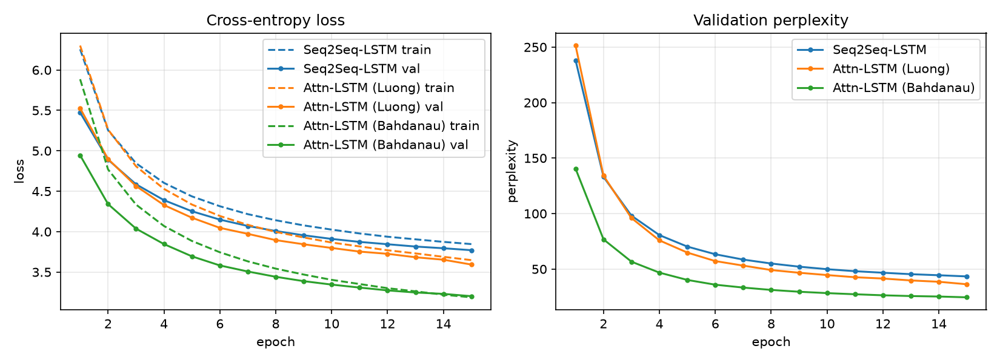
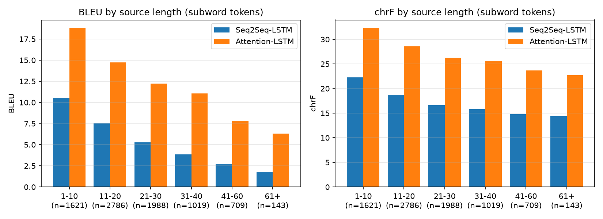
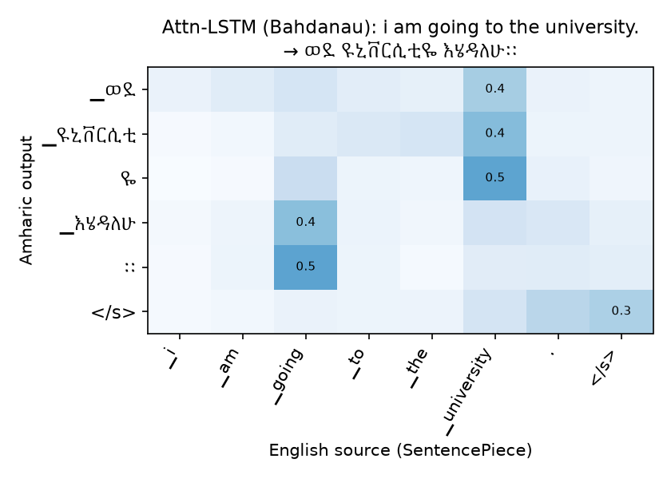
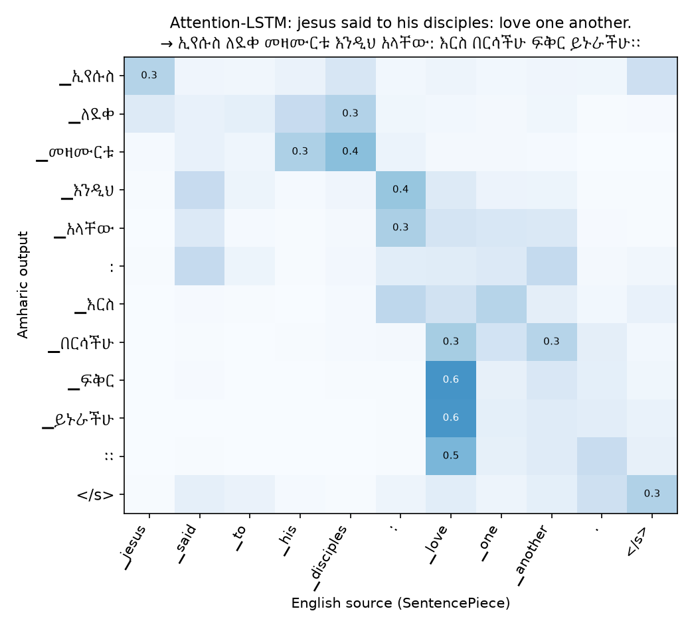
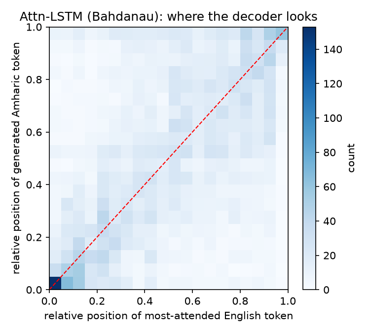

# English → Amharic Neural Machine Translation with LSTM Encoder–Decoders

**Technical report** · Deep Learning group project

_Group members: Etsubdink Zebre (GSE/0523/18), Franci Ayele (GSE/1254/18) and Henock Bonsa (GSE/3554/18)_

---

## Abstract

We build, compare and deploy two LSTM neural machine translation (NMT) systems for English → Amharic:
a **basic Seq2Seq-LSTM** and an **Attention-LSTM** (Bahdanau additive attention). They have identical
encoders, decoders, data and training budgets, so the comparison isolates the effect of attention.

The models are trained on 692k sentence pairs: the `habtew` English–Amharic corpus plus the OPUS
MT560 corpus that the assignment suggests. They are then fine-tuned for two epochs on the habtew
part and evaluated on 8,266 held-out habtew sentences that no model saw. The **Attention-LSTM more
than doubles BLEU (5.29 → 11.95)**, raises chrF from 16.9 to **26.5**, halves test perplexity
(35.3 → 17.1), and is better at every sentence length. The gap grows on long sentences. It costs
15 % more parameters and about 2× the training and inference time.

Along the way we found three things:
- The published validation split of the corpus is a verbatim copy of training and test rows, a
  leak that we removed.
- Adding more, differently-styled data helps the attention model only after in-domain fine-tuning,
  and it does not help the fixed-vector baseline at all.
- A first attention model using Luong-style attention barely beat the baseline because its
  attention **collapsed onto the sentence-final token**.

The final model learns interpretable alignments that capture English SVO → Amharic SOV reordering.
It is deployed as a public **Streamlit** app (https://amharic-nmt.streamlit.app) and a **FastAPI**
`POST /translate` service. Both apps tell users when an input is outside what the model can handle.

---

## 1. Dataset & preprocessing

### 1.1 Sources and licenses

| | Main corpus | Additional training data |
|---|---|---|
| Dataset | [`habtew/english-amharic-translation`](https://huggingface.co/datasets/habtew/english-amharic-translation) | [`michsethowusu/english-amharic_sentence-pairs_mt560`](https://huggingface.co/datasets/michsethowusu/english-amharic_sentence-pairs_mt560) (OPUS MT560) |
| Size (raw) | 237,243 pairs (published splits 172,540 / 21,568 / 43,135) | 669,145 pairs |
| License | **None declared.** The text comes mostly from public Bible translations and Jehovah's Witnesses publications, plus news and legal text, so we use it for non-commercial research only and do not redistribute it. | **CC-BY-4.0** |
| Content | Religious study articles and Bible verses, news, some legal text | Bible (older Amharic translation), JW publications, Qur'an, news, software strings. Tokenized ("word , word ?"). |
| Used for | training, **validation and test** | **training only** |

Validation and test sentences come **only** from habtew, so all phases of the project are compared on
the same sentences. `src/prepare_data.py` downloads both corpora.

### 1.2 Characteristics

* **Domain:** both corpora are dominated by religious text. Vocabulary such as *Jehovah*, *God*
  and *disciples* is very frequent, while everyday words are rare. In habtew alone, *hospital*
  appears 48 times and *bye* 22 times. MT560 adds 4.6× more text and more everyday vocabulary:
  *hospital* 667, *thank you* 227, *university* 821.
* **Casing:** inconsistent; about half of the habtew English sentences are fully lower-cased.
* **Length:** 17–19 English words and 12–13 Amharic words per sentence on average. Amharic has
  fewer, longer words because it is morphologically rich: subject, object, tense, negation and
  prepositions attach to the verb or noun as affixes.
* **Script:** Amharic uses the Ge'ez (Ethiopic) abugida, in which each character is a
  consonant+vowel syllable. There are several homophone letter families (ሀ/ሐ/ኀ, ሰ/ሠ, አ/ዐ, ጸ/ፀ)
  that writers use interchangeably. Ethiopic punctuation includes ። (full stop), ፣ (comma),
  ፤ (semicolon) and ፡ (word separator).

### 1.3 Data-quality findings

| Issue | Count |
|---|---:|
| Exact duplicate pairs in raw habtew | 21,568 |
| Duplicate pairs that sit in *different* published splits. All of them are the published validation split, which is a copy of train/test rows | **21,568** |
| Empty sentences | 7 |
| Pairs that are almost entirely digits (bare scripture citations like `luke 18: 9 14.`) | 6,290 |
| Further duplicates after normalization | 41,319 |
| Same English source with a different Amharic translation | 11,407 |
| Validation / test sentences that differ from a training sentence only in punctuation or spacing ("sing praises!" vs "sing praises.") | 574 / 566 |
| MT560 pairs that also occur in habtew (same Bible/JW sources) | 60,651 |
| MT560 pairs in the wrong script, or with software placeholders (`_`, `%s`) | 14,715 |

Because of the leakage, we pool all three published habtew splits, clean and deduplicate them, and
re-split them ourselves. We then remove every validation/test sentence that has a near-duplicate
in training, and every MT560 sentence that also occurs anywhere in habtew. The final validation and
test sets share no sentence with the training data, even when punctuation and spacing are ignored.

### 1.4 Cleaning and normalization (`src/text.py`)

The same functions run at training time and inside the deployed apps, so training and serving
cannot drift apart.

* **Both languages:** Unicode NFC; unify curly and guillemet quotes to ASCII; strip zero-width and
  private-use characters; remove bracketed verse references `(13 36)`; collapse whitespace.
* **English:** lower-case, because casing in the corpus is arbitrary. MT560 is also de-tokenized
  (`word , word ?` → `word, word?`, `it 's` → `it's`).
* **Amharic:**
  * map every homophone family to one canonical letter across all 7 vowel orders
    (e.g. ሐ→ሀ, ሠ→ሰ, ዐ→አ, ፀ→ጸ, ዓ→ኣ);
  * map labialised variants (ቈ→ቆ, ኰ→ኮ, ጐ→ጎ);
  * normalise Ethiopic punctuation: ፡ becomes a space, `::` and `፡ ፡` become ።, and no space
    is left before punctuation.
* **Filtering:** drop missing or empty rows, wrong-script rows (<50 % Latin or <50 % Ethiopic
  characters), exact duplicates, and duplicate English sources.

### 1.5 Tokenization and vocabulary

We use **SentencePiece unigram** subword models: one per language, 8,000 pieces each, with
`character_coverage = 1.0` so that every Ge'ez syllable is covered. They are trained on the
training split only. The special ids are `<pad>=0, <unk>=1, <s>=2, </s>=3`.

Subwords suit Amharic's rich morphology. For example, አልቻለችም ("she could not") is split as
`አል + ቻ + ለች + ም`: negation prefix, stem, 3rd-person feminine, negation suffix. A rare form
such as እንደሚያሳድርብህ ("that it affects you") is split into known pieces,
`እንደሚያ + ሳ + ድር + ብህ`, the last one being the object suffix "on you". The `<unk>` rate on the test set is 0 % for both languages.

### 1.6 Splits and length filtering

The 178,220 clean habtew pairs are shuffled (seed 42) and split 90 / 5 / 5. The training split is
enlarged with the 584,975 clean MT560 pairs. Training pairs longer than 50 subwords on either
side, or with a length ratio above 3, are removed (53,466 pairs). Validation and test keep
sentences up to 100 subwords so that long-sentence behaviour can be measured.

| Split | Pairs | EN words (mean / max) | AM words (mean / max) | EN subwords (mean) | AM subwords (mean) |
|---|---:|---:|---:|---:|---:|
| Train (habtew + MT560) | 691,907 | 17.3 / 49 | 12.1 / 43 | 21.6 | 20.0 |
| Validation (habtew) | 8,258 | 17.7 / 75 | 12.5 / 61 | 22.4 | 22.2 |
| Test (habtew) | 8,266 | 17.7 / 81 | 12.5 / 56 | 22.3 | 22.1 |

The training set contains 173,415 English and 444,314 Amharic word types, 2.6× more Amharic
types. This is a direct measure of Amharic's morphological richness.

---

## 2. Models & training

### 2.1 Architectures (`src/models.py`)

Both models share the same **encoder** and the same **decoder**:
- **Encoder:** a 2-layer **bidirectional** LSTM with 256 units per direction, concatenated to 512.
- **Decoder:** a 2-layer unidirectional LSTM with 512 units. It is initialised from the encoder's
  final hidden and cell states, with the two directions concatenated per layer.

The models differ only in how the decoder can see the source:

| Model | How the decoder sees the source |
|---|---|
| **Seq2Seq-LSTM** (baseline; Sutskever et al. 2014) | Only through the encoder's final states: one fixed-size vector for the whole sentence. |
| **Attention-LSTM** (Bahdanau et al. 2015, additive attention) | *Before* producing word $t$, the previous decoder state $s_{t-1}$ scores every encoder state, $e_{tj}=v^\top\tanh(W_q s_{t-1}+W_k \bar h_j)$. The softmax-weighted context $c_t$ is concatenated with the previous word's embedding as the decoder LSTM input. The output layer sees $\tanh(W_o[s_t;c_t;y_{t-1}])$. |

Padding positions are masked out of the attention softmax. The output layer is a linear layer
followed by a softmax over the 8,000 Amharic pieces.

We also trained a **Luong-attention** variant (Luong et al. 2015, multiplicative *general* score
computed after the decoder step, with input feeding) in phase 1. It is reported as an ablation in
§4.3, because its attention collapsed.

### 2.2 Training configuration (identical for both models)

| Setting | Value |
|---|---|
| Embedding size | 256 (source and target) |
| Hidden units | 512 (encoder: 2 × 256 bidirectional; decoder: 512) |
| Layers | 2 encoder + 2 decoder |
| Dropout | 0.3 (embeddings, between LSTM layers, before output) |
| Batch size | 128 sentence pairs, length-bucketed |
| Optimizer | Adam, learning rate 1e-3, ReduceLROnPlateau (×0.5, patience 1) |
| Epochs | 6 on habtew + MT560 (early stopping on validation loss, patience 3), then **2 fine-tuning epochs** on the habtew training pairs at learning rate 3e-4 |
| Loss | token-level cross-entropy, padding ignored |
| Teacher forcing | 100 % during training |
| Gradient clipping | global norm 1.0 |
| Decoding | greedy for corpus metrics; beam search (k = 5, GNMT length penalty α = 0.7) in the apps; both block immediate token repeats and repeated subword 3-grams (§3.2) |
| Hardware | Apple M1 Pro GPU (PyTorch MPS backend) |

### 2.3 How we got here: three training phases

1. **Phase 1: habtew only.** We trained on 149k habtew pairs for 15 epochs. This produced a
   working system, but it mistranslated many everyday sentences whose words are rare in the
   religious corpus.
2. **Phase 2: + MT560.** We added the 585k MT560 pairs and trained for 6 epochs. Because the data
   is 4.6× larger, that is still more updates than phase 1. Everyday sentences improved clearly,
   but BLEU on the habtew test set *dropped* (§3.2). MT560's translations are worded and spelled
   differently from habtew's references (e.g. a different Bible translation), and 78 % of the
   training data now followed MT560's style.
3. **Fine-tuning.** We continued training for 2 epochs on the habtew training pairs only
   (95,757 pairs whose English does not also occur in MT560), at a lower learning rate
   (3e-4, `src/finetune.py`). This standard domain-adaptation step keeps the broader
   vocabulary learned from MT560 and adopts the style of the test references.

Neither model had converged when the main run stopped at epoch 6; validation loss was still
falling slowly. Fine-tuning (square markers) lowers validation perplexity further, from 39.8 to
36.0 for the Seq2Seq model and from 20.4 to 17.2 for the Attention-LSTM. The attention model is
far ahead from the first epoch, and its train and validation losses stay close, so there is no
overfitting.

**Training time.** The two models were trained concurrently on the same GPU, so their wall-clock
times (218 and 312 min) are inflated. For a fair comparison we re-timed 150 training batches of
each model **in isolation** (`src/benchmark.py`):

| | Seq2Seq-LSTM | Attention-LSTM |
|---|---:|---:|
| Time per epoch (692k pairs), isolated | 15.9 min | 32.2 min |
| Estimated total (6 epochs + 2 fine-tuning epochs), isolated | 100 min | 202 min |

The baseline's decoder processes the whole target sequence in a single LSTM call. The attention
decoder must loop step by step in Python, because each step's input depends on the previous
step's attention. That is why attention costs about 2× the training time.

The saved models are `models/seq2seq.pt` and `models/bahdanau.pt` (config + weights). They are
loaded by `src/translator.py` together with `models/spm_en.model` and `models/spm_am.model`.

---

## 3. Evaluation & comparison

All metrics are on the **8,266-sentence held-out test set**. No model or tokenizer saw these
sentences, even up to punctuation. BLEU and chrF are computed with sacreBLEU on detokenized,
normalized Amharic. We report BLEU with the `intl` tokenizer as the primary number, because the
default `13a` tokenizer does not split Ethiopic punctuation (`ነው።` would be one token). `13a`
BLEU is given for reference.

### 3.1 Comparison table (final models)

| Metric | Seq2Seq-LSTM | **Attention-LSTM** |
|---|---:|---:|
| **BLEU** (greedy, full test set) | 5.29 | **11.95** |
| BLEU, `13a` tokenizer | 4.17 | **10.14** |
| **chrF** (greedy, full test set) | 16.95 | **26.48** |
| chrF++ | 15.82 | **25.28** |
| BLEU, beam 5 (first 1,000 test sentences) | 5.39 | **12.64** |
| chrF, beam 5 (first 1,000) | 16.74 | **27.34** |
| **Test loss** (cross-entropy / token) | 3.565 | **2.840** |
| Test perplexity | 35.3 | **17.1** |
| **Training time** (isolated estimate) | **100 min** | 202 min |
| **Inference time**, whole test set, batched greedy | **7.9 s** | 10.8 s |
| …per sentence (batched) | **0.96 ms** | 1.31 ms |
| Latency, one sentence, beam 5 (median; what the apps do) | **111 ms** | 223 ms |
| **Parameters** | **14.51 M** | 16.74 M |

**Verdict: the Attention-LSTM is clearly the better translator.** It gains +6.7 BLEU (2.3× the
baseline) and +9.5 chrF, and halves perplexity. The price is 15 % more parameters and about 2×
the training and inference time. At about 0.2 s per sentence with beam search, that cost does not
matter for an interactive application.

The absolute scores are low, as expected for small recurrent models trained from scratch on a
low-resource, morphologically rich language and scored against a single reference. chrF is the
more informative metric here. One Amharic word carries subject, object, tense and negation, so a
nearly-correct word (right stem, wrong suffix) scores zero in BLEU but earns partial credit in chrF.

### 3.2 What each step contributed

All rows are scored on the same 8,266 test sentences.

| Step | Seq2Seq BLEU / chrF | Attention BLEU / chrF |
|---|---:|---:|
| Phase 1: habtew only (149k pairs, 15 epochs) | **6.22** / 16.79 | 11.59 / 24.80 |
| Phase 2: + MT560 (692k pairs, 6 epochs) | 4.37 / 15.48 | 10.06 / 24.04 |
| + habtew fine-tuning (2 epochs) | 5.23 / 16.39 | 11.89 / 26.21 |
| + repetition blocking at decoding (**final**) | 5.29 / **16.95** | **11.95 / 26.48** |
| *Phase-1 Luong-attention ablation, for reference* | — | *7.66 / 19.34* |

Three observations:
- **More data helps attention, not the fixed-vector baseline.** After fine-tuning, the attention
  model beats its phase-1 version on both metrics (+0.4 BLEU, +1.7 chrF), and much more on
  everyday sentences (§3.4). The Seq2Seq baseline never recovers its phase-1 BLEU: a single
  512-d vector cannot take advantage of the more varied data.
- **A style mismatch explains the phase-2 drop, not spelling.** Normalizing the remaining spelling
  variants (ሃ/ሀ, ኣ/አ) before scoring changes BLEU by only +0.3.
- **Repetition blocking** at decoding time forbids immediate token repeats and any subword 3-gram
  occurring twice (like `no_repeat_ngram_size` in common NMT toolkits). It costs nothing to train
  and slightly improves both models. It mostly fixes visible errors such as
  "ወደ ዩኒቨርሲቲ ዩኒቨርሲቲ እሄዳለሁ".

### 3.3 Quality by sentence length

| Source length (subwords) | Sentences | Seq2Seq BLEU / chrF | **Attention BLEU / chrF** |
|---|---:|---:|---:|
| 1–10 | 1,621 | 10.5 / 22.3 | **18.8 / 32.3** |
| 11–20 | 2,786 | 7.5 / 18.7 | **14.7 / 28.6** |
| 21–30 | 1,988 | 5.3 / 16.7 | **12.2 / 26.3** |
| 31–40 | 1,019 | 3.9 / 15.8 | **11.1 / 25.5** |
| 41–60 | 709 | 2.7 / 14.8 | **7.8 / 23.7** |
| 61+ | 143 | 1.8 / 14.4 | **6.3 / 22.7** |

Quality drops with length for both models, but the gap *widens*. On 41–60-subword sentences the
attention model's BLEU is 2.9× the baseline's, against 1.8× on 1–10. Its chrF on 31–40 subwords
(25.5) is still higher than the baseline's on the shortest sentences (22.3). This is the classic
fixed-length bottleneck: one 512-d vector cannot hold a 40-word sentence, but a decoder that can
look back at every source position can. Training sentences were capped at 50 subwords, so both
models degrade most beyond that.

### 3.4 Translation examples

Source → Reference → Seq2Seq output → Attention-LSTM output (held-out test set, greedy decoding).
More examples are in [results/examples.md](results/examples.md).

| # | Source | Reference | Seq2Seq-LSTM | Attention-LSTM |
|---|---|---|---|---|
| 1 | when you are going through trials, you need people around you. | ፈተናዎች ሲያጋጥሟችሁ ከጎናችሁ የሚሆን ሰው ትፈልጋላችሁ። | መከራ ሲደርስብህ **እናንተ ራሳችሁ እናንተ ራሳችሁ** ተፈታታኝ ሁኔታዎችን መቋቋም ትችላለህ። | ፈተናዎች ሲያጋጥሙህ በአካባቢህ ያሉ ሰዎችን ያስፈልጋችኋል። ✔ |
| 2 | (john 11: 20 24) she was sure that would occur in the future. | (ዮሃ 11፣ 20 24) ወደፊት ትንሳኤ እንደሚኖር እርግጠኛ ነበረች። | (ዮሃንስ 11፣ **20**) በመሆኑም ወደፊት ምን ያህል እንደሚከናወን ለማወቅ ተስማማች። | (ዮሃ 11፣ **20 24**) ወደፊት እንደምትመጣ እርግጠኛ ነበር። |
| 3 | we prove ourselves obedient by participating in the disciple making activity. | ደቀ መዛሙርት በማድረጉ ስራ ስንካፈል ታዛዥነታችንን እናሳያለን። | ደቀ መዛሙርት በማድረጉ ስራ መካፈል ይኖርብናል። *(drops "obedient")* | ደቀ መዛሙርት በማድረጉ ስራ መካፈልን በመጠበቅ ታዛዥ በመሆን እናሳያለን። |
| 4 | … the wrath of the lord was kindled against the people, and the lord smote the people with a very great plague. | … የእግዚአብሄር ቍጣ በህዝቡ ላይ ነደደ፤ እግዚአብሄርም ህዝቡን በታላቅ መቅሰፍት እጅግ መታ። | …በትእቢት ላይ በደረሰው ጊዜ እጅግ ተቆጣ፤ ህዝቡም … እጅግ ተጨነቀ… | …የጌታ ቁጣም **በህዝቡ ላይ ነደደ**፤ ጌታም ህዝቡን **በታላቅ መቅሰፍት** ጠበቀ። |
| 5 | at that jeroboam's wife rose up and went on her way and came to tirzah. | በዚህ ጊዜ የኢዮርብአም ሚስት ተነስታ በመሄድ ወደ ቲርጻ መጣች። | በዚህ ጊዜ ወደ **ጊልያድ** ሄደ፤ እሷም ወደ **ከነአን** ሄደች። | በዚህ ጊዜ **ኢዮኣብ** ተነሳች፤ ወደ **ጰሮን** ሄደች። *(both get the names wrong)* |

Everyday sentences, typed into the deployed app (beam 5). There is no reference translation; the
✔ / ✘ marks are our own judgement:

| Input | Seq2Seq-LSTM | Attention-LSTM |
|---|---|---|
| She is Ethiopian and was born there. | እሷም ኢትዮጵያና ርብቃ ነበሩ። ✘ | **ኢትዮጵያዊ ናት፤ በዚያም ተወለደች።** ✔ |
| How much does this book cost? | ይህ የሆነው እንዴት ነው? ✘ | **ይህ መጽሃፍ ምን ያህል ዋጋ አለው?** ✔ |
| The water is cold. | የውሃ ምንጭ ነው። ✘ | **ውሃው ቀዝቃዛ ነው።** ✔ |
| The farmers are waiting for the rain. | የዱር አራዊትም ዝናብ ይደርስባቸው ነበር። ✘ | **ገበሬዎቹ ዝናብን ይጠብቃሉ።** ✔ |
| Our school has many students and teachers. | አስተማሪዎቹ መምህራንና አስተማሪዎች መምህራን ናቸው። ✘ | **ትምህርት ቤት ብዙ ተማሪዎችና አስተማሪዎች አሉት።** ✔ |
| The doctor told me to rest for two days. | በቀጣዩ ሳምንት ሁለት ቀን ንገረኝ። ✘ | **ሃኪም ለሁለት ቀናት እንድቆይ ነገረኝ።** ✔ |
| Where is the hospital? | የት አለ? ✘ (drops "hospital") | **ሆስፒታል የት አለ?** ✔ |
| Thank you very much. | በጣም አመስጋኝ ነኝ። ✔ | በጣም አመሰግናችኋለሁ። ✔ |
| I am going to the university. | ንብረቴን ቀጠልኩ። ✘ | ወደ ዩኒቨርሲቲ ገብቼ እሄዳለሁ። ≈ (adds "having entered") |
| I want to learn Amharic. | …የማወቅ ፍላጎት አደረብኝ። ✘ | ቋንቋን መማር እፈልጋለሁ። ≈ ("a language") |
| My mother cooks injera every day. | ✘ | እናቴ … በየቀኑ … ✘ (misses "cooks injera") |
| I am hungry. | ✘ | እኔ እራለሁ። ✘ |
| Welcome to Ethiopia. | ✘ | ወደ ኢትዮጵያ ተመለሱ። ✘ ("return to Ethiopia") |

---

## 4. Error & attention analysis

### 4.1 Error categories

Each category is measured by a transparent heuristic in `src/analysis.py`. These are indicators,
not perfect detectors, and we then read the outputs manually to explain them. Full examples are
in [results/error_examples.md](results/error_examples.md).

| Error type (how measured) | Seq2Seq | **Attention** |
|---|---:|---:|
| **Repeated words**: % of outputs with a repeated word or bigram that the reference lacks (before repetition blocking: 35.8 % / 22.5 %) | 17.3 % | **10.7 %** |
| **Missing words**: % of outputs shorter than 0.7 × the reference | 20.1 % | **13.9 %** |
| **Additional words**: % of outputs longer than 1.4 × the reference | 5.6 % | **5.3 %** |
| **Word order**: pairwise order disagreement of words shared with the reference (0 = same order) | 0.087 | **0.062** |
| **Morphology**: % of output words that have a reference word's stem (first 2 syllables) but the wrong affixes | **11.9 %** | 13.0 % |
| **Numbers** copied correctly (sentences with digits) | 47 % | **85 %** |
| **Named entities**: chrF with / without a proper noun in the source | 13.0 / 17.0 | **19.0 / 26.6** |
| **Rare / unknown words**: chrF with / without a source word seen ≤ 2 times in training | 12.6 / 17.3 | **18.8 / 27.1** |
| **Long sentences**: chrF on > 40 / ≤ 40 subwords | 14.7 / 17.6 | **23.5 / 27.3** |

**Repeated words** are the most common failure of both models. In example 1 above, the baseline
emits *እናንተ ራሳችሁ* ("you yourselves") twice. Without attention, the decoder has no record of what
it has already translated; once its state drifts back to a familiar region, it loops. Attention
cuts the rate from 36 % to 22 %, because each step is tied to a source position. Repetition
blocking at decoding time roughly halves both again. Some repeats remain, because synonyms and
inflected forms are different tokens.

**Missing words / early stopping.** The baseline often produces a fluent but short sentence that
covers only part of the source (example 3 drops "obedient"; "Where is the hospital?" loses
"hospital"). Information about later parts of the sentence is lost in the fixed vector. Attention
recovers much of it.

**Word order.** English is SVO and Amharic is SOV, with the verb last and postpositional phrases
before it. Both models almost always place the verb at the end, because the decoder's language
model learns this. When words match the reference, their order agrees 91–94 % of the time. The
attention maps (§4.2) show *how* the attention model performs the reordering.

**Morphology** is the one category where attention does **not** help: about 12–13 % of output
words are near misses for both models. Typical errors:
- the wrong person or number, e.g. *ፈተናዎች ሲያጋጥሙህ* ("when you (sg.) face trials") where the
  reference uses the plural *ሲያጋጥሟችሁ*;
- the wrong gender, e.g. example 2 has *ነበር* (he/it was) for *ነበረች* (she was);
- a wrong tense or a missing object suffix.

Attention decides *where to look*, but choosing the right affix depends on agreement with words
far away in the target. It also depends on seeing enough of each inflected form: the training
data has 444k distinct Amharic word types, so most forms are rare.

**Named entities** are the weakest category, with chrF 7–8 points lower. Rare names are split into
several subword pieces, and the models have no copy or transliteration mechanism, so they
substitute a frequent name of the same type (example 5: *Jeroboam* → *Joab*, *Tirzah* →
*Gilead/Canaan*). The Ethiopia/Eritrea confusion seen in the app has a similar cause: 80 of 406
habtew sentences about Ethiopia mention Eritrea in the Amharic.

**Unknown / rare words.** SentencePiece prevents true `<unk>` tokens, but sentences with a word
seen at most twice in training lose 5–8 chrF points. The model typically replaces the rare word
with a frequent in-domain one. This is also why short everyday phrases fail: "welcome" occurs
62 times in habtew, almost always as a verb ("welcome strangers"), and only 4 sentences start
with it. The greeting "Welcome to …" is essentially unseen.

**Numbers** are a clear win for attention: 47 % → 85 % are copied correctly, because a digit can
be attended to and reproduced directly (example 2: the verse numbers "20 24").

**Domain bias.** Both corpora are mostly religious text, so unrelated inputs drift toward
religious vocabulary. Adding MT560 and fine-tuning reduced this considerably (§3.4), but it is
still the main limitation for general-purpose use.

### 4.2 Attention visualisation

Heatmaps: rows are generated Amharic subwords, columns are English source subwords, and each cell
is the attention weight. All 8 maps are in `results/figures/attention_bahdanau_*.png`.

**"I am going to the university." → ወደ ዩኒቨርሲቲ ገብቼ እሄዳለሁ።** This example shows the SVO → SOV
reordering. The first Amharic words *ወደ ዩኒቨርሲቲ* ("to the university") attend to *university*,
which is the *last* content word in English. The sentence-final verb *እሄዳለሁ* ("I go") then attends
back to *going* near the start. The subject *I / am* gets no attention of its own, because Amharic
marks the first person with the verb suffix *-ለሁ*: the "I" lives inside the verb.

**"jesus said to his disciples: love one another."** Here the alignment is mostly monotone:
- *ኢየሱስ* attends to *jesus*;
- *ለደቀ መዛሙርቱ* ("to his disciples") attends to *his / disciples*; the possessive *his* is absorbed
  into the suffix *-ቱ*, so one English word becomes one Amharic morpheme;
- *እንዲህ አላቸው* ("said thus to them") attends to the colon after *said*;
- *ፍቅር ይኑራችሁ* ("have love") attends to *love*.

Over 300 test sentences, the argmax alignments spread around the diagonal. The dense corner at
the origin shows that the first Amharic word usually aligns with the first English words. The
off-diagonal mass reflects reordering. Attention is fairly soft (entropy 2.2 nats; 75 % of steps
move forward or stay). Subword units and one-to-many morphology mean that one Amharic piece often
draws on several English words.

### 4.3 Ablation: attention that does not align (Luong, phase 1)

Our first attention model (phase 1) used Luong-style multiplicative attention computed *after* the
decoder step, with input feeding. Its attention collapsed: **79 % of all decoding steps put their
maximum attention on the final `.` or `</s>` source token** (mean maximum weight 0.86), against
4 % for the Bahdanau model trained on the same data. The heatmap above is typical: every Amharic
word attends to the last two columns.

The encoder is bidirectional, so the forward LSTM state at the final position summarises the whole
sentence. The model found it easier to fetch that summary repeatedly than to learn an alignment. In
effect it used attention as a second copy of the baseline's "thought vector", so it was only
slightly better than the baseline (BLEU 7.66 vs 6.22 on this test set, against 11.59 for Bahdanau).

We attribute the difference to two design details:
- In Luong attention, the bilinear score $h_t^\top W_a \bar h_s$ is computed from the current decoder
  output, and one position whose state resembles the decoder's can satisfy it easily.
- In Bahdanau attention, the *previous* state must choose a context *before* the word is generated,
  and the additive MLP score learns position-specific features.

Both push the model to use the context as its main input. The lesson: **"having an attention
layer" does not guarantee alignment.** Attention maps should be inspected, not assumed.

---

## 5. Deployment

The trained Attention-LSTM, with the Seq2Seq-LSTM as a selectable baseline, is deployed in two ways
that share the same inference pipeline:

* a **Streamlit web app** (`streamlit_app.py`), hosted on Streamlit Community Cloud at
  **https://amharic-nmt.streamlit.app**. It offers example sentences, a model selector, beam size,
  the translation, latency, input warnings and the attention heatmap. It redeploys automatically
  on every push to the GitHub repository;
* a **FastAPI REST API** (`app/main.py`), with a small web UI. It loads both checkpoints and
  tokenizers once at start-up, warms them up, and serves:

| Endpoint | Purpose |
|---|---|
| `POST /translate` | `{"text": "I am going to the university."}` → `{"translation": "ወደ ዩኒቨርሲቲ ገብቼ እሄዳለሁ።", "model": "bahdanau", "latency_ms": 223, "warnings": [], "suggestions": {}}`. Optional fields: `model` (`bahdanau` = Attention-LSTM, the default, or `seq2seq`), `beam` (1–10, default 5) and `return_attention` (adds tokens and the attention matrix). Invalid input → HTTP 422. |
| `GET /scope` | The plain-language description of what the translator handles |
| `GET /health` | Liveness and loaded models |
| `GET /` | Web UI with a live attention heatmap |
| `GET /docs` | Auto-generated interactive OpenAPI docs |

**Inference pipeline** (`src/translator.py`), the same code used for evaluation:
1. `normalize_en` the raw English, exactly as in training;
2. convert to SentencePiece ids and append `</s>`;
3. run the encoder;
4. run beam search (k = 5, length penalty, repetition blocking);
5. strip special tokens and SentencePiece-decode to an Amharic string.

**Translation scope and input warnings.** §4 showed that errors concentrate on rare words, names,
and inputs unlike the training sentences. For example, "Bye" is tokenized as `by + e` and mistranslated.
Both apps therefore state what the system handles (complete sentences of about 5–30 words on
everyday, news and religious topics). They also attach a warning to any input that:
- is shorter than 4 words (only 2.5 % of training sentences are that short);
- lacks final punctuation (94 % of training sentences end with punctuation);
- is longer than 50 words;
- contains a word seen fewer than 30 times, or never, in training.

The per-word training counts ship with the models in `models/en_word_freq.json`. The warnings do
not change the translation; they tell the user when not to trust it.

**Spelling suggestions.** A common cause of unseen words is a typo. For example, "I love switherland."
became እግሮቼን እወዳለሁ። ("I love my legs"), because the misspelled name is split into `s + with + er + land`.
The correct spelling, "Switzerland" (161 occurrences in training), gives ስዊዘርላንድን እወዳለሁ።. For every unseen
word, the apps therefore look for a well-attested training word (≥ 30 occurrences) within one edit
(two for words of six or more letters). The distance is Damerau–Levenshtein, so a swapped pair
of letters counts as one edit. Ties go to a same-length word, then to the more frequent word. If a
match is found, the apps suggest it ("Did you mean 'switzerland'?"), and Streamlit offers to translate
the corrected sentence in one click.

The deployment needs only `models/` (≈ 125 MB: two checkpoints, tokenizers and word counts),
`src/`, `requirements.txt` (CPU PyTorch) and either `streamlit_app.py` or `app/` (also packaged as
a `Dockerfile`).

---

## 6. Conclusions

1. **Attention matters, if it actually aligns.** The Bahdanau Attention-LSTM beats the plain
   Seq2Seq-LSTM on every metric and at every length (BLEU 11.95 vs 5.29, chrF 26.5 vs 16.9).
   Its advantage grows with sentence length, confirming the fixed-vector bottleneck. It also
   repeats less, drops fewer words, copies numbers far better, and handles rare words and names
   better.
2. **Data needs a model that can use it.** Adding 585k MT560 pairs, followed by in-domain
   fine-tuning, improved the attention model and especially its handling of everyday sentences.
   The same data did not help the fixed-vector baseline.
3. **Inspect attention.** A Luong-style layer with the same capacity collapsed onto the
   sentence-final summary state and gave almost no gain. Only the heatmaps revealed this.
4. **What remains hard is linguistic:** Amharic morphology (wrong affixes), rare named entities,
   and the religious domain of the available data.

**Limitations and future work.** Neither model had converged (6 epochs on the combined data).
Evaluation uses a single reference translation from one domain. The models have no copy mechanism
for names and numbers, and no coverage model. Natural next steps are longer training, more
conversational data, a pointer/copy mechanism, coverage modelling, and a Transformer baseline.

## References

* Sutskever, Vinyals & Le (2014). *Sequence to Sequence Learning with Neural Networks.*
* Cho et al. (2014). *Learning Phrase Representations using RNN Encoder–Decoder.*
* Bahdanau, Cho & Bengio (2015). *Neural Machine Translation by Jointly Learning to Align and Translate.*
* Luong, Pham & Manning (2015). *Effective Approaches to Attention-based Neural Machine Translation.*
* Tiedemann (2012). *Parallel Data, Tools and Interfaces in OPUS.* Gowda et al. (2021), *Many-to-English Machine Translation Tools, Data, and Pretrained Models* (MT560).
* Kudo & Richardson (2018). *SentencePiece.*
* Post (2018). *A Call for Clarity in Reporting BLEU Scores* (sacreBLEU). Popović (2015). *chrF.*
